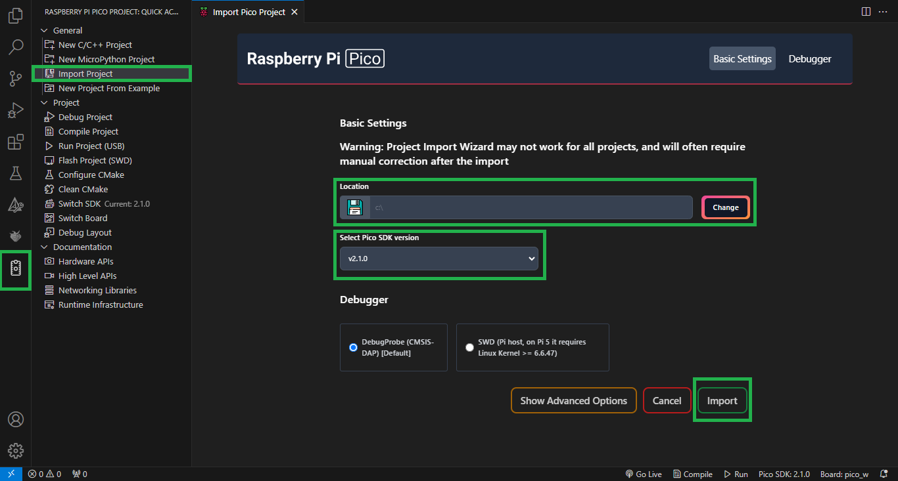
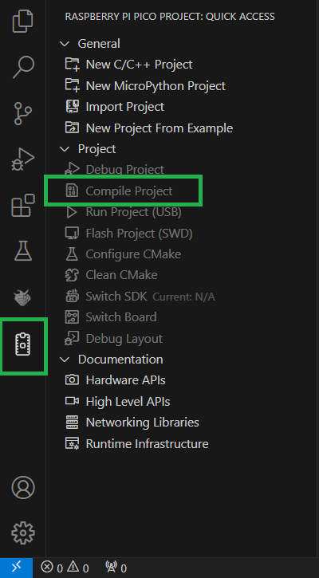

# PWM  

## Descrição do Projeto  

Este projeto visa explorar o controle de ângulo de um servomotor utilizando o módulo PWM do microcontrolador RP2040 na placa Raspberry Pi Pico W. O objetivo é simular o controle de um motor micro servo padrão no simulador Wokwi, bem como realizar um experimento com um LED RGB usando a Ferramenta Educacional BitDogLab.  

## Pré-requisitos  

Antes de executar o projeto, certifique-se de ter os seguintes softwares e ferramentas instalados:  

- [Visual Studio Code (VS Code)](https://code.visualstudio.com/download)  
- [Extensão Raspberry Pi Pico para VS Code](https://marketplace.visualstudio.com/items?itemName=raspberry-pi.raspberry-pi-pico)  
- [Extensão Wokwi Simulator para VS Code](https://marketplace.visualstudio.com/items?itemName=Wokwi.wokwi-vscode)  
- [Git](https://git-scm.com/downloads)  
- [SDK para Raspberry Pi Pico (Pico SDK)](#instalação-e-configuração-do-ambiente)  

Além disso, será necessário possuir uma conta no [site oficial do Wokwi](https://wokwi.com/).  

## Estrutura do Repositório  

```
├── .vscode/                    # Configurações específicas do projeto para o VS Code
├── img/                        # Imagens utilizadas no README para detalhar o projeto
├── .gitignore                  # Arquivos ignorados pelo Git
├── CMakeLists.txt              # Configuração do CMake para o projeto
├── README.md                   # Instruções e detalhes do projeto
├── diagram.json                # Arquivo de configuração para o simulador Wokwi
├── pico_sdk_import.cmake       # Configuração para importar o Pico SDK
├── pwm.c                       # Código-fonte principal do projeto
└── wokwi.toml                  # Arquivo de configuração do Wokwi
```
`OBS.:` o subdiretório `build/` será adicionado ao diretório principal após a configuração automática do CMake.  

## Instalação e Configuração do Ambiente
1. Clone este repositório para seu ambiente local:  
   ```
   git clone https://github.com/SauloAntunes/Tarefa-PWM.git  
   ```

2. Com o VS Code aberto, configure o ambiente de desenvolvimento do Pico SDK, seguindo as instruções:  
    - O Pico SDK pode ser configurado de forma automática durante a configuração do projeto através da extensão Raspberry Pi Pico no VS Code.  
      
    - Passo a passo:  
    `1º:` acesse a extensão Raspberry Pi Pico;  
     `2º:` selecione a opção `Import Project`;  
    `3º:` adicione o caminho do projeto no seu dispositivo, selecione a versão 2.1.0 do Pico SDK (é importante selecionar essa versão para evitar possíveis incompatibilidades) , e por fim clique em `Import`.  
    `OBS.:` após isso, a própria ferramenta realizará a configuração do Pico SDK. Durante o processo de configuração, notificações serão exibidas no canto inferior direito da tela, indicando cada etapa.  

3. Compile o projeto:  
  
  - Passo a passo:  
    `1º:` com o projeto aberto no VS Code, acesse a extensão Raspberry Pi Pico;  
    `2º:` clique na opção `Compile Project` e aguarde o processo de compilação.   

4. Com o VS Code aberto, configure o ambiente Wokwi, seguindo as instruções:
    - A configuração do Wokwi para VS Code pode ser realizada seguindo as orientações disponíveis na [documentação oficial](https://docs-wokwi-com.translate.goog/vscode/getting-started?_x_tr_sl=en&_x_tr_tl=pt&_x_tr_hl=pt&_x_tr_pto=tc&_x_tr_hist=true).

5. Inicie a simulação do projeto:  
    - Para iniciar a simulação do projeto clique no arquivo `diagram.json`, logo em seguida será aberta uma tela com a simulação do projeto, contendo os componentes como a placa Raspberry Pi Pico W, o servomotor, entre outros. Após a abertura da simulação do projeto, clique no botão verde de começar.  

## Estrutura de Controle  

**IMPORTANTE**: o LED azul conectado no GPIO 12 foi configurado da mesma forma do servomotor, logo, ele realizará as mesmas operações.  

- Quando o sistema é inicializado:
    - A flange (braço) do servomotor realizará um movimento para a posição de, aproximadamente, 180 graus. E aguarda 05 segundos nesta 
posição;
    - A flange do servomotor realizará um movimento para a posição de, aproximadamente, 90 graus. E aguarda 05 segundos nesta 
posição;
    - A flange do servomotor realizará um movimento para a posição de, aproximadamente, 0 graus. E aguarda 05 segundos nesta 
posição;
    - Após a realização dos três movimentos anteriores, haverá uma movimentação periódica do braço do servomotor entre os 
ângulos de 0 e 180 graus.

## Vídeo de Apresentação da Solução

Para mais detalhes sobre a implementação e os resultados, assista ao vídeo da solução: [Link para o vídeo](https://drive.google.com/file/d/1ByhYp2SBo6Ra5vwOWDnxRKvKXVNtXwn8/view?usp=sharing).  